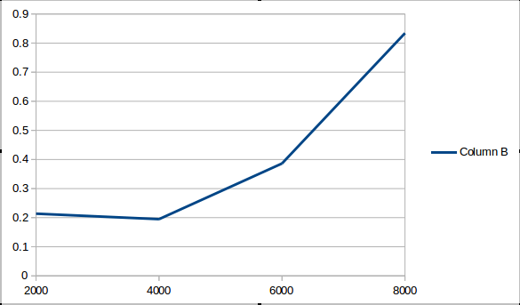
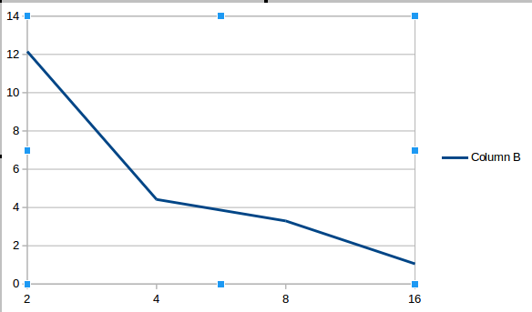

Запуск на кластере c подсчетом времени
======================================

Производилось 2 опыта:

* Запуск алгоритма производился на 16 процессах, на графах с кол-вом вершин от 2000 до 8000 с шагом в 2000
```
python3 runner_graph.py
```

**Результаты:**



* Запуск алгоритма производился на графе с кол-вом вершин 5000, на 2, 4, 8, 16 процессах
```
python3 runner_proc.py
```	

**Результаты:**


